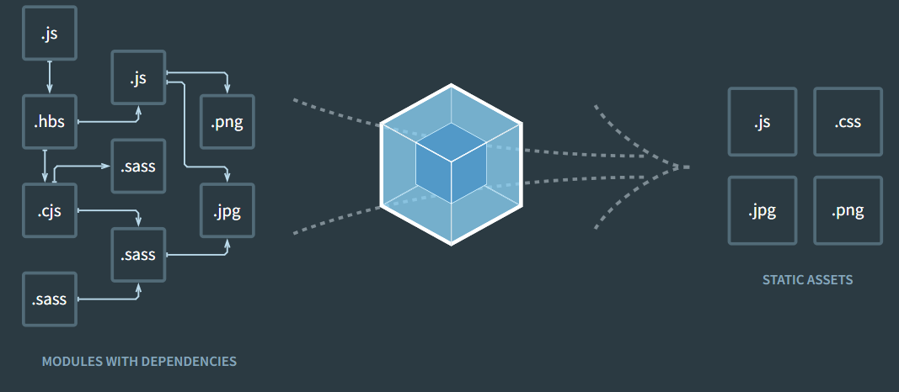
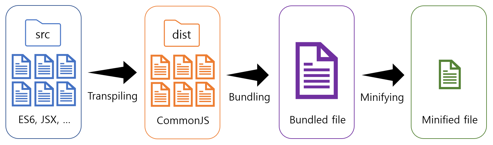

# 번들링과 Webpack

## 모듈

- 파일 하나 (분리된 파일 각각..)-> ex. 스크립트 하나는 모듈 하나.
- `export`, `import`를 적용하면 다른 모듈을 불러와 불러온 모듈에 있는 함수를 호출하는 것과 같은 기능 공유가 가능

### 모듈 다루기

- 예제

  ```jsx
  <script src="./js/scriptA.js"></script>
  <script src="./js/scriptB.js"></script>
  <script src="./js/scriptC.js"></script>
  <script src="./js/scriptD.js"></script>
  ```

  - 위와 같이 사용하는 것은 모듈화가 되어있지 않은 상태
  - 각 script에 해당하는 js 파일들은 서로 스코프를 공유
  - 예로, 위와 같은 코드에서는 scriptB.js 안에 있는 코드에서 scriptA.js에 있는 변수에 접근 가능
  - 모듈을 html에서 사용하기 위해서는 script 태그에 type="module"을 명시

    ```jsx
    // index.html
    <script src="./js/index.js" type="module"></script>;

    // index.js
    import moduleA from "./moduleA.js";
    // 메인 실행 코드
    ```

    ```jsx
    // moduleA.js
    import moduleB from "./moduleB.js";

    const moduleA = {
      // moduleB에 의존성을 가지는 내부 로직
    };

    export default moduleA;
    ```

    ```jsx
    // moduleB.js
    const moduleB = {};

    export default moduleB;
    ```

    - 위와 같은 형태로 모듈 파일들을 구성하면 index.html가 실행되었을 때, index.js -> moduleA.js -> moduleB.js 와 같은 의존성에 의해 각각의 모듈이 실행
    - 모듈화가 되었기에 각각의 모듈 파일은 서로의 스코프를 공유하지 않고, 캡슐화와 정보은닉이 된 상태

<br />
<br />

---

<br />
<br />

## 웹팩

- 웹을 구성하고 있는 HTML, CSS, JAVASCRIPT 등을 모두 각각의 모듈로 보고 이를 조합해서 하나로 만들어주는 도구
- js모듈의 의존관계를 추적해서 하나의 파일 혹은 n개의 파일로 bundling 해줄 수 있는 도구
- code를 minify 시켜줄 수도 있고, 페이지에서는 빌드된 파일만을 불러오기 때문에 페이지 로딩 속도가 개선되며, 자원 소비도 줄일 수 있다는 장점

    

  <br />
  <br />

### React 에서의 웹팩

1. React 에서의 build mode 실행

   ```jsx
   // 빌드 실행
   npm run build
   ```

- chunk.js나 main.js 같은 이름들의 번들 파일들을 확인 가능
- index.html 파일도 확인 가능
- 빌드 시 index.html에 만들어진 번들 파일들이 적용되어 있음
- 빌드를 완료 했으면, 리액트를 실행

  ```jsx
  // 리액트 하나로는 실행이 안됨
  // 웹 서버를 만들고 그 위에 리액트 어플리케이션을 실행
  npm install -g serve
  serve -s build
  ```

- +) build 부분을 위의 웹 서버가 아닌, nginx나 apache 웹 서버를 react application에 올리면 배포가 바로 가능 (배포 관련 부분은 이후 알아보자...)
  <br/>

2. React 에서의 development mode 실행

   ```jsx
   //개발 명령어를 실행
   npm start
   ```

- build시에는 서버를 실행하려면 serve라는 프로그램을 통해 실행

- 개발모드로 실행 시에는 서버가 바로 동작

  - 개발 모드에서는 webpack이 서버로 동작

- react 실행 시 작동 순서

  A. react-scripts로 실행 시 파일들을 처음 빌드하여 번들 파일로 만든다.  
   B. 번들 파일들이 반영된 index.html을 만든다  
   C. 웹 브라우저 실행 후 접속을 한다.(localhost:3000)  
   D. 웹팩이 준비한 index.html에서 scripts 태그의 자바스트립트 코드를 실행하여 웹 페이지에 보여준다.  
   E. 웹팩 서버는 새로운 파일의 생성 수정 삭제를 감시한다.  
   F. 처음 빌드 한 번들 파일과 비교 후 변경된 부분이 있다면, 해당 부분만 빌드한다.  
   G. 브라우저의 웹팩과 상호작용하여 변경 된 부분을 실시간으로 반영한다.

  - 코딩과 동시에 서버에 반영되는 부분은 hot reloading 이라고 한다
    <br/>

3. webpack.config.js

- 웹팩에 대한 설정은 webpack.config.js을 통해 할 수 있다.

  3.1. Entry

  - 자바스크립트 파일의 진입점이자 시작점을 지정

  ```jsx
  // webpack.config.js
  module.exports = {
    entry: "./path/to/my/entry/file.js",
  };

  //기본값은 ./src/index.js 이지만, 위의 코드처럼 다른 엔트리 포인트를 지정 가능
  ```

  3.2. Output

  - 빌드 시 적용되는 속성에 대한 설정
  - output 내부의 값으로는 path와 filename을 기본값으로 적어주면 된다.

  ```jsx
  // webpack
  const path = require("path");

  module.exports = {
    entry: "./path/to/my/entry/file.js",
    output: {
      path: path.resolve(__dirname, "dist"),
      filename: "my-first-webpack.bundle.js",
      clean: true,
    },
  };

  // path는 번들(=빌드=변환)된 파일을 생성할 경로를 적어주는 곳
  // (상대 경로를 넣으면 찾을 수가 없다. 따라서 path라는 모듈을 넣고 resolve 매서드를 사용하여야, 절대 경로로 웹팩이 찾을 수 있다.)

  // filename은 생성될 파일 이름을 지정해 주는 속성

  // clean 부분은 안 적어도 된다.
  // 그러나 true로 설정을 해주면, 새롭게 생성될 경로에 다른 파일들이 있다면, 다 삭제하고 새로운 파일을 생성하는 속성
  ```

  3.3. Loaders

  - webpack은 기본적으로 javascript와 JSON 파일만 이해
  - .css 파일 같은 경우를 webpack이 이해하게 하려면 Loaders 부분에서 설정
  - test와 use로 두 가지 속성

  ```jsx
  const path = require("path");

  module.exports = {
    output: {
      filename: "my-first-webpack.bundle.js",
    },
    module: {
      rules: [
        {
          //test에 있는 내용은 .txt 파일을 선택하라는 뜻
          test: /\.txt$/,
          // use는 test에서 지정한 파일들을 use에 적은 모듈을 활용해서 불러들인다는 뜻
          use: "raw-loader",
          // 위의 코드를 풀이하면, .txt 파일이 확인되면 번들에 추가하기 전에 raw-loader을 사용하여 변환
        },
      ],
    },
  };
  ```

  3.4. Plugins

  ```jsx
  const HtmlWebpackPlugin = require("html-webpack-plugin");
  const webpack = require("webpack"); // 내장 plugin에 접근하는 데 사용

  module.exports = {
    module: {
      rules: [{ test: /\.txt$/, use: "raw-loader" }],
    },
    plugins: [
      new HtmlWebpackPlugin({
        // html의 head부분의 title을 넣어주는 것과 같다.
        title: "keyboard",
        // template은 최상위 루트의 상대 경로로 지정
        template: "./index.html",
        // inject : 파일을 번들했을 때, js를 바디에 넣어줄지 해더에 넣어줄지를 설정하는 것이다. 이 값 안 넣으면 html이 해더에 들어간다.
        inject: "body",
        // favicon은 파비콘(웹페이지 상단의 title 옆의 아이콘)으로 사용할 위치를 적어둠
        favicon: "./favicon.ico",
      }),
    ],
  };
  ```

  3.5. Mode

  - 기본값은 production으로 none으로 지정하면 webpack에 내장된 환경별 최적화를 활성화

  ```jsx
  module.exports = {
    mode: "production",
  };

  // string = 'production': 'none' | 'development' | 'production'
  // production : html, css, javascript 코드의 난독화 제공
  // -> 번들 후에 코드의 사이즈를 최대한 줄여 배포 환경에 최적화
  ```

---

<br />
<br />

## 참고 - 빌드 과정

<br/>

   
<br/>

1. 트랜스파일(Transpiling)

- 구형 브라우저들이 고급 JS 문법을 이해하지 못한다는 호환성 문제가 존재
- 이 문제를 해결하기 위해 트랜스파일이라는 기법을 적용
- 트랜스파일은 하나의 프로그래밍 언어로 작성된 파일을 아예 다른 프로그래밍 언어가 아닌, 비슷한 수준의 언어로 변환하는 기법
- JS 의 트랜스파일은 최신 버전의 JS 코드를 구형 버전의 JS 코드로 변환하기 위해 활용

2. 번들링(Bundling)

- 각각의 JS 파일을 사용하기 위해 파일을 불러오는 순서를 고려하면서 무수히 많은 스크립트 태그를 추가해야하는 등의 문제가 발생
- 이 문제를 해결하기 위해 수많은 JS 파일과 모듈을 하나의 파일로 묶는 번들링 기법 등장

3. 압축(Minifying)

- 수많은 파일들을 하나의 파일에 담은 만큼 파일 용량이 커짐
- JS 파일을 브라우저 상으로 로드하는 시간이 늘어남
- 번들 파일에 압축(Minifying) 기법을 적용하면서 해결
- 파일 용량과 로드 시간을 최적화한 JS 빌드 파일을 생성

<br />
<br />

---

[참고 링크1 - 모듈 예시](https://cocoder16.tistory.com/55)  
[참고 링크2 - 리액트에서 다루는 웹팩](https://han-py.tistory.com/448)  
[참고 링크3 - 컴파일과 번들링 개념. SASS 파일 컴파일 하면서 Gulp 사용한 경험이 생각나서](https://prod.velog.io/@zuzokim/%EC%BB%B4%ED%8C%8C%EC%9D%BC%EB%B2%88%EB%93%A4%EB%A7%81Webpack-Babel-Gulp)  
[참고 링크4 - 번들링과 빌드의 개념 혼동](https://blog.linewalks.com/archives/8190)
